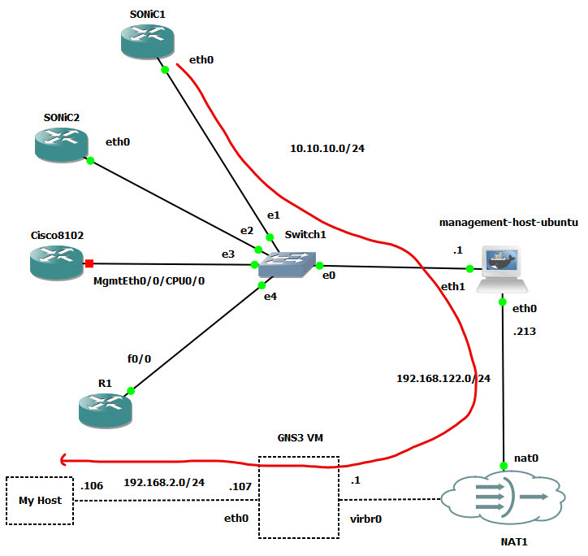

# GNS-Sonic-Sniff

GNS-Sonic-Sniff is a lightweight, extensible packet sniffing utility designed specifically for Sonic-based network devices. Developed in Python and powered by the `scapy` library, it provides per-interface traffic monitoring capabilities without the need for external tools such as `tcpdump`.

The script can be executed locally on the Sonic host, making it ideal for in-field diagnostics, real-time debugging, and interface-level traffic analysis. Captured packets can be displayed live on the terminal, saved to a `.pcap` file, or streamed via UDP to a remote collector for centralized analysis.

## Usage Examples

scapy is pre-installed on most Sonic builds. If it's missing, it can be installed as follows (assuming internet connectivity is available):

    pip install scapy==2.4.4

Capture traffic on Ethernet0 for 10 seconds and display parsed packets on the terminal:

    admin@sonic:~$ sudo python sniffer_local.py -i Ethernet0 -t 10 --print_stdout

Example output:

    Sniffing on interface 'Ethernet0' started...
    Hostname: sonic
    PID: 5380

    Ether / ARP who has 10.0.0.1 says 10.0.0.0
    Ether / ARP who has 10.0.0.1 says 10.0.0.0
    Ether / ARP who has 10.0.0.1 says 10.0.0.0
    22:f5:91:69:ea:f4 > 01:80:c2:00:00:0e (LLDP) / Raw
    Ether / IP / ICMP 1.1.1.1 > 1.1.1.2 echo-request 0 / Raw
    Ether / IP / ICMP 1.1.1.2 > 1.1.1.1 echo-reply 0 / Raw
    Ether / ARP who has 10.0.0.1 says 10.0.0.0
    Ether / IP / ICMP 1.1.1.1 > 1.1.1.2 echo-request 0 / Raw
    Ether / IP / ICMP 1.1.1.2 > 1.1.1.1 echo-reply 0 / Raw
    Ether / ARP who has 10.0.0.1 says 10.0.0.0

Capture and save traffic to a `.pcap` file:

    admin@sonic:~$ sudo python sniffer_local.py -i Ethernet0 -t 10 -o traffic.pcap

Capture and forward traffic over UDP to a remote collector:

    admin@sonic:~$ sudo python sniffer_local.py -i Ethernet0 -t 10 --stream_packets --collector_ip 10.10.10.1 --collector_port 65535

You can limit captured traffic using Berkeley Packet Filter (BPF) syntax. To capture only ICMP packets over IP:

    admin@sonic:~$ sudo python sniffer_local.py -i Ethernet0 -t 10 --filter 'ether proto 0x0800 and icmp' --print_stdout

## UDP Collector and Forwarding

Consider the following GNS3 network topology from our earlier [GNS-Bench](https://github.com/ManiAm/GNS-Bench) project.



**UDP Packet Collector**

A sample implementation of a UDP-based packet collector is available in [here](packet_collector.py). This script runs on our local machine, listening on a designated UDP port for incoming traffic streamed from remote Sonic1 devices.

**Network Forwarding via `socat`**

In our network above, the Sonic1 device is located behind multiple jump hosts. To facilitate end-to-end UDP delivery, each intermediate node must forward packets along the chain toward the final collector. This is where `socat` (SOcket CAT) comes in. Socat is a powerful and flexible command-line utility that creates bidirectional data streams between various types of endpoints such as sockets, files, pipes, or pseudo-terminals. It is often used for tasks such as port forwarding, tunneling, network debugging, and protocol bridging.

**Static Build of `socat`**

A statically linked binary of `socat` includes all dependencies in a single executable. This is especially useful on resource-constrained or locked-down systems such as embedded devices or network appliances where required shared libraries may be missing or incompatible. For this project, static binaries are used to forward UDP packets from intermediate jump hosts that may not have `socat` pre-installed. You can download prebuilt static binaries from [here](https://github.com/ernw/static-toolbox/releases).

**UDP Packet Forwarder**

An implementation of a simple UDP forwarder is available in [udp_forwarder.py](udp_forwarder.py). This tool should be deployed on each jump host (e.g., gns3-vm, mgmt-host) to relay packets toward the local collector. The workflow assumes that passwordless SSH access is configured between the local machine and each jump host. For example:

    ssh gns3-vm
    ssh mgmt-host

should connect without prompting for a password. This enables automation and streamlined deployment of forwarders and collectors across your GNS3-based network testing infrastructure.

## Sniffer Program

You can find the complete orchestrator script in [main_sniffer.py](main_sniffer.py). This utility automates the entire workflow: it sets up UDP forwarding through intermediate jump hosts, establishes an SSH connection to the target Sonic device (Sonic1), and remotely launches sniffer_local.py. Captured packets are streamed back to the local host, decoded, and displayed in real-time. Ensure that the [ssh_config](ssh_config) file is updated to reflect your environment and host configurations.

    python3 main_sniffer.py

Here is an example output:

```text
Connecting to remote router.
2025-07-11 06:03:59,879 [INFO] Connected (version 2.0, client OpenSSH_9.2p1)
2025-07-11 06:03:59,921 [INFO] Auth banner: b'Debian GNU/Linux 12 \\n \\l\n\n'
2025-07-11 06:03:59,921 [INFO] Authentication (password) successful!

Forwarding mgmt-host → gns3-vm

2025-07-11 06:04:01,891 [INFO] [+] Auto-detected local IP: 192.168.122.1
2025-07-11 06:04:01,898 [INFO] Connected (version 2.0, client OpenSSH_8.2p1)
2025-07-11 06:04:02,005 [INFO] Authentication (publickey) successful!
2025-07-11 06:04:02,006 [INFO] [+] Connected to 192.168.2.107
2025-07-11 06:04:02,066 [INFO] Connected (version 2.0, client OpenSSH_8.2p1)
2025-07-11 06:04:02,172 [INFO] Authentication (publickey) successful!
2025-07-11 06:04:02,172 [INFO] [+] Connected to 192.168.122.213
2025-07-11 06:04:02,228 [WARNING] [!] socat not found on 192.168.122.213, uploading static binary...
2025-07-11 06:04:02,277 [INFO] [chan 1] Opened sftp connection (server version 3)
2025-07-11 06:04:02,475 [INFO] [chan 1] sftp session closed.
2025-07-11 06:04:02,475 [INFO] [+] Uploaded socat to /tmp/socat
2025-07-11 06:04:02,475 [INFO] [+] Running on 192.168.122.213:/tmp/socat UDP-LISTEN:6343,fork UDP:192.168.122.1:16343
2025-07-11 06:04:04,481 [INFO] [+] socat started successfully.
2025-07-11 06:04:04,481 [INFO] [+] Forwarder is running.

Forwarding gns3-vm → local host

2025-07-11 06:04:04,482 [INFO] [+] Auto-detected local IP: 192.168.2.106
2025-07-11 06:04:04,488 [INFO] Connected (version 2.0, client OpenSSH_8.2p1)
2025-07-11 06:04:04,595 [INFO] Authentication (publickey) successful!
2025-07-11 06:04:04,595 [INFO] [+] Connected to 192.168.2.107
2025-07-11 06:04:04,655 [WARNING] [!] socat not found on 192.168.2.107, uploading static binary...
2025-07-11 06:04:04,703 [INFO] [chan 1] Opened sftp connection (server version 3)
2025-07-11 06:04:04,741 [INFO] [chan 1] sftp session closed.
2025-07-11 06:04:04,741 [INFO] [+] Uploaded socat to /tmp/socat
2025-07-11 06:04:04,741 [INFO] [+] Running on 192.168.2.107:/tmp/socat UDP-LISTEN:16343,fork UDP:192.168.2.106:26343
2025-07-11 06:04:06,745 [INFO] [+] socat started successfully.
2025-07-11 06:04:06,745 [INFO] [+] Forwarder is running.

Starting sniffer collector on port 26343 for 120 seconds...
2025-07-11 06:04:06,746 [INFO] Listening for UDP packets for 120 seconds...

Starting remote sniffer for 120 seconds...
2025-07-11 06:04:08,230 [INFO] Connected (version 2.0, client OpenSSH_9.2p1)
2025-07-11 06:04:08,272 [INFO] Auth banner: b'Debian GNU/Linux 12 \\n \\l\n\n'
2025-07-11 06:04:08,272 [INFO] Authentication (password) successful!
2025-07-11 06:04:15,061 [INFO]  Sniffer logs: sniffer_42496.log
2025-07-11 06:04:15,062 [INFO]  Sniffing on interface 'Ethernet0' started...
2025-07-11 06:04:15,062 [INFO]  Hostname: sonic
2025-07-11 06:04:15,062 [INFO]  PID: 64398
2025-07-11 06:04:15,062 [INFO]  Streaming captured packets to remote collector

Collecting sniffed packets in real-time...

Ether / IP / ICMP 1.1.1.1 > 1.1.1.2 echo-request 0 / Raw
Ether / IP / ICMP 1.1.1.2 > 1.1.1.1 echo-reply 0 / Raw
Ether / IP / ICMP 1.1.1.1 > 1.1.1.2 echo-request 0 / Raw
Ether / IP / ICMP 1.1.1.2 > 1.1.1.1 echo-reply 0 / Raw
Ether / IP / ICMP 1.1.1.1 > 1.1.1.2 echo-request 0 / Raw
Ether / IP / ICMP 1.1.1.2 > 1.1.1.1 echo-reply 0 / Raw
Ether / IP / ICMP 1.1.1.1 > 1.1.1.2 echo-request 0 / Raw
Ether / IP / ICMP 1.1.1.2 > 1.1.1.1 echo-reply 0 / Raw
```

## Practical Use Cases

Here are some of the use cases and deployment scenarios:

- **Traffic Capture & Analysis**: Captured traffic can be written to `.pcap` files for offline analysis using tools like Wireshark, which is helpful for deeper inspection or sharing traces with others. The tool also supports time-bounded capture sessions using `-t` option, allowing operators to collect short bursts of traffic during specific troubleshooting windows without generating unnecessary data or requiring manual termination.

- **Packet Monitoring & Diagnostics**: The sniffer is ideal for real-time diagnostics at the interface level, helping network engineers quickly inspect traffic flowing through a specific interface. By applying BPF filters, users can focus on relevant protocols such as ICMP, ARP, LLDP, or specific IP ranges, making it easy to isolate issues. This is particularly useful for debugging connectivity problems, verifying routing behavior, or ensuring protocol operations like ARP resolution and DNS lookups are functioning correctly.

- **Centralized Packet Collection**: The sniffer supports streaming captured packets over UDP to a centralized collector, enabling live monitoring and analysis from a remote location. This is particularly useful in environments with multiple devices where centralized visibility is essential. Even in complex topologies involving multiple SSH jump hosts, the tool supports end-to-end forwarding using socat, making it suitable for enterprise or lab deployments with restricted access paths.

- **Event Triggering & Alerting**: The utility can be integrated into alerting workflows by triggering notifications when specific traffic patterns are detected (for example, unusual ICMP activity, unexpected ARP broadcasts, or protocol violations). This makes it a lightweight, scriptable intrusion detection mechanism suitable for edge routers or test environments where full-scale IDS systems may not be feasible.

- **Automation & Testing**: In CI/CD pipelines or automated testbeds, the sniffer can validate that expected traffic is flowing between virtual devices, confirming correct configuration of routing, VLANs, ACLs, or QoS. It also helps in regression testing by ensuring no unintended traffic is introduced after changes to Sonic software, device firmware, or topology configuration, making it a valuable tool in network validation workflows.

## Limitation of Packet Sniffing

Here are some of the known limitations:

- **Lack of Visibility Across All Interfaces**: It operates per-interface, meaning it only monitors one interface at a time unless parallel instances are run, which increases complexity and resource usage.

- **Not Scalable for Large Networks**: Capturing and streaming full packets is bandwidth-intensive and does not scale well when monitoring dozens of interfaces or devices.

- **No Sampling**: It captures every packet on the interface, which can be unnecessary and excessive for traffic analytics purposes.

- **Limited to User-Space Visibility**: Since it uses scapy, it's limited to packets that reach user space and may miss hardware-dropped or kernel-level events.

## sFlow (Sampled Flow)

sFlow (Sampled Flow) is a packet sampling technology used to monitor high-speed networks by providing a scalable method for collecting traffic statistics. Instead of analyzing every packet, sFlow-enabled devices (like routers and switches) periodically sample packets and export metadata including interface counters and flow records to a centralized collector. This lightweight approach minimizes the performance impact on network devices while still delivering rich visibility into traffic patterns, bandwidth usage, and network behavior, making it ideal for large-scale monitoring and analytics.

**Enabling sFlow Service on SONiC NOS**

Sonic includes support for sFlow through a systemd-managed container service. However, by default, the `sflow.service` may be masked, which prevents it from being started manually or automatically. In systemd, a masked service is one that is deliberately disabled by linking it to /dev/null. This prevents it from being started, either manually or during boot, regardless of other settings. Masking is typically used to ensure a service is completely disabled, even if enable is called elsewhere.

Check service status:

    admin@sonic:~$ sudo systemctl status sflow

    ○ sflow.service
        Loaded: masked (Reason: Unit sflow.service is masked.)
        Drop-In: /etc/systemd/system/sflow.service.d
                └─auto_restart.conf
        Active: inactive (dead)

To allow the service to be managed, unmask it:

    admin@sonic:~$ sudo systemctl unmask sflow

This step ensures the sFlow container will start automatically on reboot. Note: it does not start the service immediately.

    admin@sonic:~$ sudo systemctl enable sflow

Manually start the sFlow service:

    admin@sonic:~$ sudo systemctl start sflow

Verify service status:

    admin@sonic:~$ sudo systemctl status sflow

    ● sflow.service - sFlow container
        Loaded: loaded (/lib/systemd/system/sflow.service; static)
        Drop-In: /etc/systemd/system/sflow.service.d
                └─auto_restart.conf
        Active: active (running) since Wed 2025-07-09 23:35:02 UTC; 2s ago
        Process: 87047 ExecStartPre=/usr/bin/sflow.sh start (code=exited, status=0/>
        Main PID: 87109 (sflow.sh)
        Tasks: 2 (limit: 4569)
        Memory: 28.0M
        CGroup: /system.slice/sflow.service
                ├─87109 /bin/bash /usr/bin/sflow.sh wait
                └─87112 python3 /usr/local/bin/container wait sflow

Confirm the sFlow container is running:

    admin@sonic:~$ docker ps

    CONTAINER ID   IMAGE                 COMMAND                  CREATED         STATUS         PORTS     NAMES
    9fca73288815   docker-sflow:latest   "/usr/local/bin/supe…"   3 minutes ago   Up 3 minutes             sflow

This confirms that the sFlow service is active and the container is running.

## sFlow Program

You can find the complete orchestrator script in [main_sflow.py](main_sflow.py). This utility automates the entire workflow: it sets up UDP forwarding through intermediate jump hosts, establishes an SSH connection to the target Sonic device (Sonic1), and enables sFlow. sFlow streams back to the local host, and we decode and display them. Ensure that the [ssh_config](ssh_config) file is updated to reflect your environment and host configurations.
